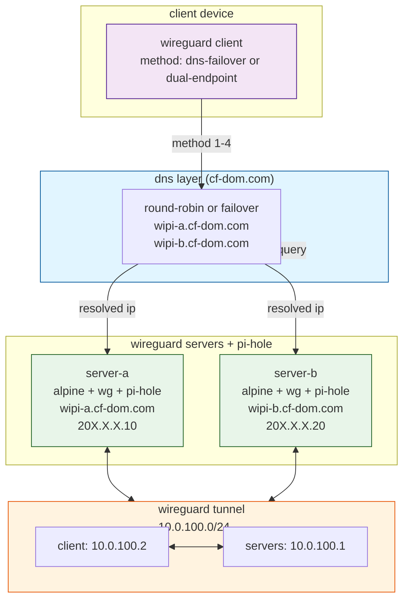

# wipi

wireguard + pi(zero-2w)-hole + alpine

install, configure, setup and manage wireguard and pi-hole on alpine for pi zero 2 w

## architecture



---

## quick start

run `bootstrap.sh` for initial setup

---

## alpine setup

- download alpine for pi zero 2 w
- flash on sd-card
- boot pi and run `bootstrap.sh`

## wireguard setup

### install

run `bootstrap.sh` or see playbooks for automated setup

### configuration

`/etc/wireguard/wg0.conf`

```sh
[Interface]
Address = 10.0.100.1/24
PrivateKey = <server-private-key>
ListenPort = 51820
PostUp = iptables -A FORWARD -i wg0 -j ACCEPT
PostUp = iptables -A FORWARD -o wg0 -j ACCEPT
PostUp = iptables -t nat -A POSTROUTING -o eth0 -j MASQUERADE
PostDown = iptables -D FORWARD -i wg0 -j ACCEPT
PostDown = iptables -D FORWARD -o wg0 -j ACCEPT
PostDown = iptables -t nat -D POSTROUTING -o eth0 -j MASQUERADE
```

### admin tools

- `bootstrap.sh` — initial setup and installation
- `wi-adm.sh` — client config add, revoke, renew
- playbooks — automated setup and config

## pi-hole setup

run `bootstrap.sh` or see playbooks for automated setup

## dns configuration

### cloudflare ddns

- `cf-ddns.sh` — static ddns update
- `ddns-cron.sh` — periodic ddns update
- `cf-api.py` — dynamic dns via cloudflare api

## client failover mechanisms

four methods for automatic failover between two wireguard servers

### method 1: dns round-robin load balancing

dns returns multiple a-records for same hostname; clients rotate through them

**setup:**
```
wipi.cf-dom.com  A  203.0.113.10    (server a)
wipi.cf-dom.com  A  198.51.100.20   (server b)
ttl = 60
```

**client config:**
```sh
[Interface]
PrivateKey = <client-private-key>
Address = 10.0.100.2/32
DNS = 10.0.100.1

[Peer]
PublicKey = <server-public-key>
AllowedIPs = 0.0.0.0/0
Endpoint = wipi.cf-dom.com:51820
PersistentKeepalive = 25
```

**pros:** simple, transparent to wireguard  
**cons:** no intelligent failover, relies on dns behavior

---

### method 2: dns failover with retry

same hostname resolves to multiple ips; client retries on first endpoint failure

**setup:**
same as method 1 (multiple a-records)

**client config:**
same as method 1

**requires:** client-side retry logic or dns resolver with failover behavior

**pros:** automatic retry on failure  
**cons:** depends on client resolver implementation

---

### method 3: dual-endpoint in client config

wireguard client has multiple peers with same allowedips; uses first available

**setup:**
```
server-a public key: <pubkey-a>
server-b public key: <pubkey-b>
```

**client config:**
```sh
[Interface]
PrivateKey = <client-private-key>
Address = 10.0.100.2/32
DNS = 10.0.100.1

[Peer]
PublicKey = <server-a-public-key>
AllowedIPs = 0.0.0.0/0
Endpoint = wipi-a.cf-dom.com:51820
PersistentKeepalive = 25

[Peer]
PublicKey = <server-b-public-key>
AllowedIPs = 0.0.0.0/0
Endpoint = wipi-b.cf-dom.com:51820
PersistentKeepalive = 25
```

**pros:** true wireguard native failover, automatic switching  
**cons:** each peer must have own public key, increases client config size

---

### method 4: active-passive with shared public key

both servers share same public key; client uses single endpoint with dns failover

**setup:**
```
server-a and server-b: configure with shared peer public key
dns: wipi.cf-dom.com → server-a (primary)
     wipi.cf-dom.com → server-b (fallback)
```

**client config:**
```sh
[Interface]
PrivateKey = <client-private-key>
Address = 10.0.100.2/32
DNS = 10.0.100.1

[Peer]
PublicKey = <shared-public-key>
AllowedIPs = 0.0.0.0/0
Endpoint = wipi.cf-dom.com:51820
PersistentKeepalive = 25
```

**important:** both servers must accept same client public key in their peer config

**server-a config:**
```sh
[Peer]
PublicKey = <client-public-key>
AllowedIPs = 10.0.100.2/32
```

**server-b config:**
```sh
[Peer]
PublicKey = <client-public-key>
AllowedIPs = 10.0.100.2/32
```

**pros:** simple client config, automatic dns failover  
**cons:** requires shared key management, possible routing issues if both active

---

## recommended setup

**for most use cases:** use method 3 (dual-endpoint) for true wireguard failover

**for simplicity:** use method 1 or 2 (dns round-robin) with dns resolver supporting failover

---

## config templates

templates are available in two formats:

### envsubst templates (shell scripts)

for use with shell scripts: `.conf`

```bash
# export variables
export CLIENT_PRIVATE_KEY="$(wg genkey)"
export CLIENT_ADDRESS="10.0.100.2/32"
export PIHOLE_IP="10.0.100.1"
export SERVER_PUBLIC_KEY="<key>"
export WIREGUARD_DOMAIN="wipi.cf-dom.com"

# substitute and generate config
envsubst < templates/client-dns-failover.conf > wg0.conf
```

**available templates:**
- `client-dns-failover.conf` — method 1/2 dns failover
- `client-dual-endpoint.conf` — method 3 dual-endpoint

### jinja2 templates (ansible)

for use with ansible playbooks: `.j2`

```yaml
- name: generate wireguard config
  template:
    src: templates/client-dns-failover.conf.j2
    dest: /etc/wireguard/wg0.conf
  vars:
    client_private_key: "{{ lookup('file', '/path/to/privatekey') }}"
    client_address: "10.0.100.2/32"
    pihole_ip: "10.0.100.1"
    server_public_key: "{{ server_pubkey }}"
    wireguard_domain: "wipi.cf-dom.com"
```

**available templates:**
- `client-dns-failover.conf.j2` — method 1/2 dns failover
- `client-dual-endpoint.conf.j2` — method 3 dual-endpoint

---

## client access

- access mode

### dns

use pi-hole ip (10.0.100.1) as dns resolver, or set to cloudflare public dns (1.1.1.1)

### platforms

- windows
- linux
- macos
- android
- ios
