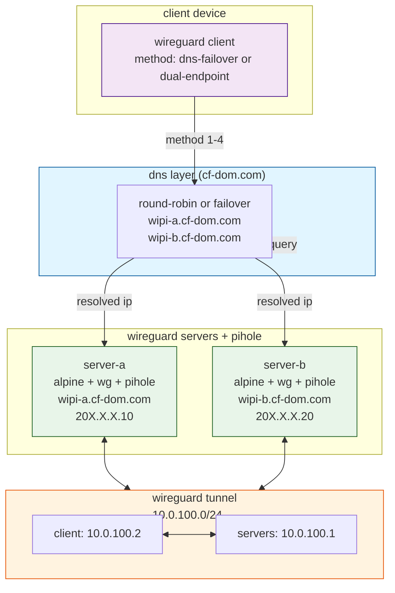

# client failover

two methods for multi-server failover.

## architecture



---

## method 1: dns failover

single endpoint hostname, dns resolves to active server.

**dns setup (cloudflare or any provider):**

```
wipi.domain.com  A  203.0.113.10   (server a)
wipi.domain.com  A  198.51.100.20  (server b)
ttl = 60
```

**generate client config:**

```sh
export CLIENT_PRIVATE_KEY=$(wg genkey)
export CLIENT_ADDRESS=10.0.100.2/32
export PIHOLE_IP=10.0.100.1
export SERVER_PUBLIC_KEY=<server-pubkey>
export WG_ENDPOINT=wipi.domain.com

envsubst < templates/client-dns-failover.conf > wg0.conf
```

---

## method 2: dual endpoint

two peers in one client config. wireguard switches automatically.

**requires:** a separate public key per server.

**generate client config:**

```sh
export CLIENT_PRIVATE_KEY=$(wg genkey)
export CLIENT_ADDRESS=10.0.100.2/32
export PIHOLE_IP=10.0.100.1
export SERVER_A_PUBLIC_KEY=<pubkey-a>
export SERVER_B_PUBLIC_KEY=<pubkey-b>
export WG_ENDPOINT_A=wipi-a.domain.com
export WG_ENDPOINT_B=wipi-b.domain.com

envsubst < templates/client-dual-endpoint.conf > wg0.conf
```

---

## recommendation

use method 2 (dual endpoint) for true wireguard-native failover.

use method 1 for simplicity when both servers share the same public key (active-passive).
